# HMS Complete System - Single UML Diagram

## Complete Hospital Management System - Comprehensive View

```plantuml
@startuml HMS Complete System Architecture

!define RECTANGLE class

' ============================================
' FRONTEND LAYER
' ============================================
package "Frontend (React + Vite)" #LightBlue {
  
  package "Pages" {
    RECTANGLE DoctorDashboard {
      + stats: Object
      + appointments: Array
      --
      + fetchDashboardData()
      + render()
    }
    
    RECTANGLE AddPatient {
      + formData: Object
      --
      + handleSubmit()
      + addNewPatient()
    }
    
    RECTANGLE AdmitPatient {
      + patients: Array
      + beds: Array
      + selectedBed: Object
      --
      + fetchAvailableBeds()
      + handleSubmit()
      + admitPatient()
    }
    
    RECTANGLE PatientDetailsPage {
      + patient: Object
      + activeTab: String
      + prescriptions: Array
      + labTests: Array
      --
      + fetchPatientDetails()
      + addPrescription()
      + orderLabTest()
    }
    
    RECTANGLE DoctorLabTests {
      + labTests: Array
      + stats: Object
      --
      + fetchLabTests()
      + viewTestDetails()
    }
  }
  
  package "API Services" {
    RECTANGLE doctorAPI {
      + addNewPatient(data)
      + admitPatient(data)
      + getAvailableBeds()
      + addPrescription(id, data)
      + orderLabTest(id, data)
      + getPatientDetails(id)
      + getDoctorLabTests()
      + getPatientPrescriptions(id)
    }
  }
  
  package "Components" {
    RECTANGLE Sidebar
    RECTANGLE Navbar
    RECTANGLE StatCard
  }
}

' ============================================
' BACKEND LAYER
' ============================================
package "Backend (Node.js + Express)" #LightGreen {
  
  package "Routes" {
    RECTANGLE authRoutes
    RECTANGLE doctorRoutes {
      POST /patients
      POST /admissions
      GET /beds/available
      POST /patients/:id/prescriptions
      POST /patients/:id/lab-tests
      GET /patients/:id
      GET /lab-tests
      GET /patients/:id/prescriptions
    }
  }
  
  package "Controllers" {
    RECTANGLE DoctorController {
      + addNewPatient(req, res)
      + admitPatient(req, res)
      + getAvailableBeds(req, res)
      + addPrescription(req, res)
      + orderLabTest(req, res)
      + getPatientDetails(req, res)
      + getDoctorLabTests(req, res)
      + getPatientPrescriptions(req, res)
    }
    
    RECTANGLE AuthController {
      + login(req, res)
      + register(req, res)
    }
  }
  
  package "Middleware" {
    RECTANGLE auth {
      + verifyToken()
      + checkRole()
    }
  }
  
  package "Utils" {
    RECTANGLE idGenerator {
      + generatePatientId()
      + generateAdmissionId()
      + generateLabTestId()
      + generatePrescriptionId()
    }
  }
}

' ============================================
' DATABASE LAYER
' ============================================
package "MongoDB Database" #LightYellow {
  
  entity User {
    * _id: ObjectId
    --
    firstName: String
    lastName: String
    email: String
    password: String
    phone: String
    role: Enum
  }
  
  entity Patient {
    * _id: ObjectId
    --
    user: ObjectId FK
    patientId: String (PAT-XXXXXXXXXX)
    dateOfBirth: Date
    gender: String
    bloodGroup: String
    address: Object
    emergencyContact: Object
    medicalHistory: Object
    primaryDoctor: ObjectId FK
    treatingDoctors: [ObjectId] FK
  }
  
  entity Doctor {
    * _id: ObjectId
    --
    user: ObjectId FK
    employeeId: String
    department: ObjectId FK
    specialization: String
    qualification: String
    experience: Number
  }
  
  entity Prescription {
    * _id: ObjectId
    --
    prescriptionId: String (PRX-XXXXXXXXXX)
    patient: ObjectId FK
    doctor: ObjectId FK
    diagnosis: String
    medicines: [{
      medicineName: String
      dosage: String
      frequency: String
      duration: String
    }]
    createdAt: Date
  }
  
  entity Admission {
    * _id: ObjectId
    --
    admissionId: String (ADM-XXXXXXXXXX)
    patient: ObjectId FK
    doctor: ObjectId FK
    bed: ObjectId FK
    admissionDate: Date
    reason: String
    diagnosis: String
    treatmentPlan: String
    status: Enum
  }
  
  entity Bed {
    * _id: ObjectId
    --
    bedNumber: String
    ward: {type, floor}
    status: Enum
    currentPatient: ObjectId FK
    currentAdmission: ObjectId FK
  }
  
  entity LabTest {
    * _id: ObjectId
    --
    labTestId: String (LAB-XXXXXXXXXX)
    patient: ObjectId FK
    doctor: ObjectId FK
    testName: String
    testCategory: String
    status: Enum
    urgency: Enum
    results: Array
  }
  
  entity Appointment {
    * _id: ObjectId
    --
    appointmentId: String
    patient: ObjectId FK
    doctor: ObjectId FK
    appointmentDate: Date
    status: Enum
    prescription: ObjectId FK
  }
}

' ============================================
' RELATIONSHIPS & DATA FLOW
' ============================================

' Frontend to API
DoctorDashboard --> doctorAPI
AddPatient --> doctorAPI
AdmitPatient --> doctorAPI
PatientDetailsPage --> doctorAPI
DoctorLabTests --> doctorAPI

DoctorDashboard ..> Sidebar
AddPatient ..> Navbar
PatientDetailsPage ..> StatCard

' API to Backend Routes
doctorAPI --> doctorRoutes : HTTP/HTTPS
doctorAPI --> authRoutes : HTTP/HTTPS

' Routes to Middleware to Controllers
authRoutes --> auth
doctorRoutes --> auth
auth --> DoctorController
auth --> AuthController

' Controllers to Utils
DoctorController ..> idGenerator

' Controllers to Database Models
DoctorController --> Patient : CRUD
DoctorController --> Doctor : READ
DoctorController --> Prescription : CREATE
DoctorController --> Admission : CREATE
DoctorController --> Bed : READ/UPDATE
DoctorController --> LabTest : CREATE/READ
DoctorController --> Appointment : READ/UPDATE

AuthController --> User : CRUD

' Database Relationships
User ||--o| Patient : has
User ||--o| Doctor : has

Patient }o--|| Doctor : primaryDoctor
Patient }o--o{ Doctor : treatingDoctors

Prescription }o--|| Patient : belongs to
Prescription }o--|| Doctor : written by

Admission }o--|| Patient : for
Admission }o--|| Doctor : admitted by
Admission }o--|| Bed : occupies

Bed ||--o| Patient : currentPatient
Bed ||--o| Admission : currentAdmission

LabTest }o--|| Patient : for
LabTest }o--|| Doctor : ordered by

Appointment }o--|| Patient : booked by
Appointment }o--|| Doctor : with
Appointment ||--o| Prescription : generates

' ============================================
' NOTES & ANNOTATIONS
' ============================================

note right of AddPatient
  **Add Patient Flow:**
  1. Doctor fills form
  2. Generates PAT-XXXXXXXXXX ID
  3. Creates User + Patient records
  4. Sets primaryDoctor
  5. Adds to treatingDoctors
end note

note right of AdmitPatient
  **Admit Patient Flow:**
  1. Search patient
  2. Filter available beds
  3. Select bed
  4. Generate ADM-XXXXXXXXXX ID
  5. Create admission
  6. Update bed status to 'occupied'
  7. Link patient to doctor
end note

note right of PatientDetailsPage
  **Patient Details Features:**
  - View patient info
  - Add prescriptions (PRX-XXXXXXXXXX)
  - Order lab tests (LAB-XXXXXXXXXX)
  - View prescription history
  - View lab test results
  - Update medical records
end note

note bottom of Prescription
  **Prescription Structure:**
  - Auto-generated ID
  - Diagnosis text
  - Medicines array with:
    * medicineName
    * dosage
    * frequency
    * duration
  - validUntil (30 days)
  - Linked to patient & doctor
end note

note bottom of LabTest
  **Lab Test Workflow:**
  requested → sample-collected →
  in-process → completed
  
  Ordered by doctor
  Processed by lab technician
  Results visible to doctor
end note

note bottom of Bed
  **Bed Management:**
  Status: available | occupied | maintenance
  Ward Types: General, ICU, NICU, Private
  Tracks current patient & admission
end note

legend right
  **Key Technologies:**
  - Frontend: React 18 + Vite + Tailwind CSS
  - Backend: Node.js + Express
  - Database: MongoDB + Mongoose
  - Auth: JWT tokens
  - State: React hooks + localStorage
  
  **ID Formats:**
  - Patient: PAT-XXXXXXXXXX
  - Prescription: PRX-XXXXXXXXXX
  - Admission: ADM-XXXXXXXXXX
  - Lab Test: LAB-XXXXXXXXXX
  
  **Key Features Implemented:**
  ✓ Doctor can add patients
  ✓ Doctor can admit patients
  ✓ Doctor writes prescriptions
  ✓ Doctor orders lab tests
  ✓ Patient-doctor relationships
  ✓ Bed management
  ✓ Lab test tracking
  ✓ Prescription history
end legend

@enduml
```



---

## How to Use

1. **Copy the entire code block above** (from ```plantuml to ```)
2. **Visit**: http://www.plantuml.com/plantuml/uml/
3. **Paste** the code in the text area
4. **Click "Submit"**
5. **Download** the generated diagram as PNG/SVG

## What This Diagram Shows

This single comprehensive diagram includes:

### ✅ Frontend Layer (Blue)
- All React pages (Dashboard, AddPatient, AdmitPatient, PatientDetails, DoctorLabTests)
- API services (doctorAPI)
- Shared components (Sidebar, Navbar, StatCard)

### ✅ Backend Layer (Green)
- Routes (authRoutes, doctorRoutes with all endpoints)
- Controllers (DoctorController with all methods)
- Middleware (auth with token verification)
- Utils (ID generators)

### ✅ Database Layer (Yellow)
- All 8 main collections
- Complete field structures
- All relationships with cardinality
- Foreign key references

### ✅ Data Flow
- Frontend → API → Routes → Middleware → Controllers → Database
- All CRUD operations shown
- Relationships indicated with proper notation

### ✅ Annotations
- Add Patient flow explanation
- Admit Patient flow explanation
- Patient Details features
- Prescription structure
- Lab Test workflow
- Bed management details
- Legend with technologies and ID formats

This is a **complete, working, single diagram** that shows your entire HMS system architecture!
